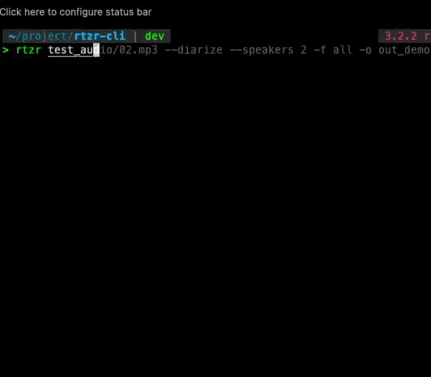
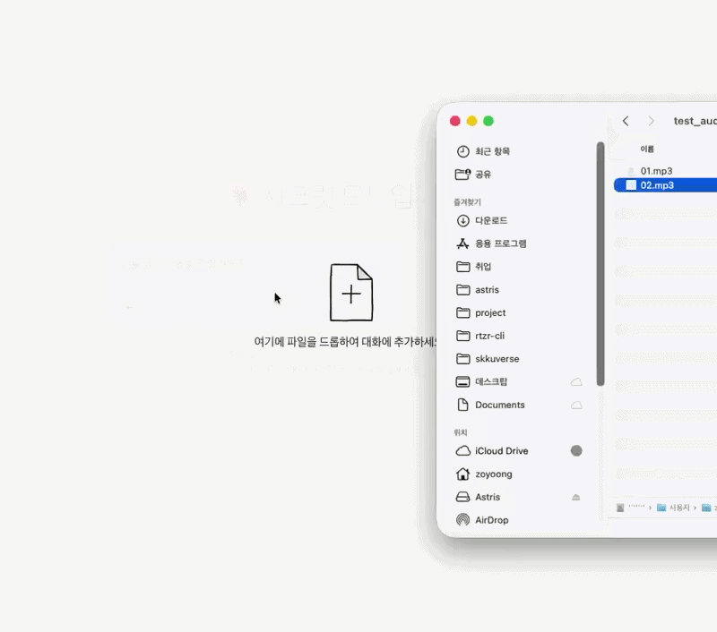

# RTZR-CLI & MCP


[](https://www.npmjs.com/package/@spencer0124/rtzr-cli)


**rtzr-cli**는 [RTZR (Return Zero)](https://developers.rtzr.ai/)의 음성인식(STT)을 터미널과 Claude로 바로 가져오는 오픈소스 CLI & MCP입니다. Whisper처럼 익숙한 명령어 한 줄로, 오디오 파일에서 대본·자막까지 가장 빠른 경로를 제공합니다.  
<br><br>

## Architecture

- `rtzr-core` : rtzr API wrapper ([npm](https://www.npmjs.com/package/@spencer0124/rtzr-core))
- `rtzr-cli` : rtzr-core 기반 CLI ([guide](#-installation))
- `rtzr-mcp` : rtzr-core 기반 MCP 서버 ([guide](#2-mcp))

```
                ┌────────────────────────────────────────┐
                │         @spencer0124/rtzr-core         │
                │   auth · submit · poll · format · zod  │
                └──────────────────┬─────────────────────┘
              ┌─────────────────────┴─────────────────────┐
              ▼                                           ▼
        rtzr CLI (npm/npx)                               MCP
        로컬 파일 + 로컬 키                      URL/base64 입력 + BYO-key 헤더
```

<p align="center">
  
  
</p>
<p align="center">
  <sub><b>왼쪽:</b> <code>rtzr</code> CLI — 화자분리 + 4개 포맷 저장 · <b>오른쪽:</b> 원격 MCP — Claude에서 바로 전사</sub>
</p>

<br><br>

# (1) CLI

## 📦 Installation

### Run instantly with npx

```bash
# Using npx (no installation required)
npx @spencer0124/rtzr-cli
```

### Install globally with npm

```bash
npm install -g @spencer0124/rtzr-cli
```

## ⚙️ Configuration

```bash
# RTZR_CLIENT_ID / RTZR_CLIENT_SECRET을 대화형으로 입력, 로컬에 저장
rtzr configure
```

- 환경변수 `RTZR_CLIENT_ID` / `RTZR_CLIENT_SECRET`이 존재하면 로컬 설정보다 우선 사용됩니다.
- 키 저장위치는 사용자 홈 설정 폴더입니다(`env-paths`, OS별 표준 경로).
- `rtzr configure`로 언제든 키를 다시 저장할 수 있습니다.

## ▶️ Usage

```bash
rtzr audio.mp3 --diarize                          # 화자분리 포함 txt 출력
rtzr audio.mp3 -f srt --diarize --speakers 2       # 화자 2명 지정, SRT 출력
rtzr *.wav -f all -o out                           # 여러 파일, 모든 포맷(txt/srt/vtt/json)
rtzr audio.mp3 --keywords 리턴제로 스티티            # 키워드 부스팅
rtzr audio.mp3 --json                              # 원본 API 응답 JSON을 stdout으로
```

| 플래그                                             | 설명                                                   | 기본값        |
| -------------------------------------------------- | ------------------------------------------------------ | ------------- |
| `-f, --output-format <fmt>`                        | `txt\|srt\|vtt\|json\|all`                             | `txt`         |
| `-o, --output-dir <dir>`                           | 출력 디렉터리                                          | `.`           |
| `-l, --language <lang>`                            | `ko\|ja\|en\|detect\|multi`                            | `ko`          |
| `--model <name>`                                   | `sommers\|whisper`                                     | `sommers`     |
| `--diarize`                                        | 화자분리(`use_diarization`) 활성화                     | off           |
| `--speakers <n>`                                   | 예상 화자 수, `0`=자동(`spk_count`) — `--diarize` 필요 | —             |
| `--keywords <kw...>`                               | 키워드 부스팅(가중치 문법 없음)                        | —             |
| `--language-candidates <langs...>`                 | 언어 감지 후보군(`--model whisper` 전용)               | `ko/ja/zh/en` |
| `--itn` / `--no-itn`                               | 역정규화(ITN)                                          | on            |
| `--profanity-filter`                               | 비속어 필터                                            | off           |
| `--disfluency-filter` / `--no-disfluency-filter`   | 간투어 필터                                            | on            |
| `--paragraph-splitter` / `--no-paragraph-splitter` | 문단 나누기                                            | on            |
| `--paragraph-max <n>`                              | 문단 최대 글자 수(문단 나누기 on일 때만)               | `50`          |
| `--word-timestamps`                                | 단어별 타임스탬프 포함(`--json`에서만 확인 가능)       | off           |
| `--domain <GENERAL\|CALL>`                         | 도메인                                                 | —             |
| `--json`                                           | 파일 출력 대신 원본 응답 JSON을 stdout에 출력          | off           |

<details>
<summary><b>🔄 Whisper에서 넘어오기</b> — 플래그 매핑 및 재해석 근거 (펼치기)</summary>

Whisper 사용감을 그대로 흉내 내되, 플래그를 기계적으로 복사하지 않고 RTZR API의 실제 동작에 맞춰
재해석했습니다.

```bash
# Whisper
whisper audio.mp3 --model medium --language Korean --output_format srt --output_dir out

# rtzr (같은 손맛)
npx @spencer0124/rtzr-cli audio.mp3 --language ko --output_format srt --output_dir out --diarize
```

| Whisper                                  | rtzr                                                          | 왜 이렇게 매핑했는가                                                                                                        |
| ---------------------------------------- | ------------------------------------------------------------- | --------------------------------------------------------------------------------------------------------------------------- |
| `audio.mp3`(위치 인자)                   | `audio.mp3`                                                   | 동일. 다중 파일/글롭 지원                                                                                                   |
| `--output_format {txt,vtt,srt,tsv,json}` | `-f txt\|srt\|vtt\|json\|all`                                 | `tsv`는 RTZR 응답 구조와 안 맞아 생략                                                                                       |
| `--output_dir` / `-o`                    | 동일                                                          | 기본값 `.`                                                                                                                  |
| `--language`                             | `-l ko\|ja\|en\|detect\|multi`                                | ISO 코드로 매핑                                                                                                             |
| `--model tiny/base/small/medium/large`   | `--model sommers\|whisper`                                    | **개념 재해석** — 로컬 모델 "크기"라는 축이 RTZR엔 없음. 대신 한국어 특화(`sommers`) vs 다국어(`whisper`)라는 축으로 재정의 |
| `--task transcribe/translate`            | `transcribe`만 지원                                           | RTZR은 번역을 별도 파이프라인으로 처리해 근본적으로 다름 — 억지로 맞추지 않고 명시적으로 뺌                                 |
| `--word_timestamps`                      | `--word-timestamps`                                           | 동일 개념(`use_word_timestamp`)                                                                                             |
| (없음)                                   | `--diarize`, `--speakers <n>`                                 | **RTZR 고유** — Whisper엔 없는 화자분리(`use_diarization`, `spk_count`; `0`=자동)                                           |
| (없음)                                   | `--keywords <kw...>`                                          | **RTZR 고유** — 키워드 부스팅. 가중치 문법 없음, `sommers`는 한글 발음 표기 필수, 단어당 20자 이하·최대 500개               |
| (없음)                                   | `--itn/--no-itn`, `--profanity-filter`, `--disfluency-filter` | **RTZR 고유** 후처리 옵션                                                                                                   |

</details>

<br><br>

# (2) MCP

Claude Code 등 MCP 클라이언트에서 바로 붙일 수 있는 **원격 MCP 서버** — Cloudflare Workers 배포,
stateless, `@spencer0124/rtzr-core` 재사용.

## 🔌 Setup

```bash
# 키 없이 바로 써보기 (데모용 공유 키로 폴백)
claude mcp add --transport http rtzr https://rtzr.seungyongcho.com/mcp

# BYO-key: 자기 RTZR 키로 사용 (권장)
claude mcp add --transport http rtzr https://rtzr.seungyongcho.com/mcp \
  --header "X-RTZR-CLIENT-ID: ..." --header "X-RTZR-CLIENT-SECRET: ..."
```

- 헤더 생략 시 데모용 공유 키로 폴백합니다 — 다른 사용자와 RTZR 쿼터를 같이 쓰는 체험용.
- 진지하게 쓰려면 BYO-key 헤더로 자기 키를 넣으세요.
- 서버는 어느 쪽 키든 **저장하지 않습니다** — 해당 요청을 처리하는 동안만 메모리에서 사용.

## 🧰 Tools

### `transcribe`

| 파라미터               | 타입                                        | 기본값        | 설명                                                                                    |
| ---------------------- | ------------------------------------------- | ------------- | --------------------------------------------------------------------------------------- |
| `input`                | string (필수)                               | —             | http(s) URL 또는 base64 인코딩된 오디오. 엣지 런타임엔 파일시스템이 없어 로컬 경로 불가 |
| `filename`             | string                                      | 자동 유추     | 코덱 판별용 파일명 힌트. URL은 경로/Content-Type에서 자동 추정, base64 입력은 명시 권장 |
| `model`                | `sommers` \| `whisper`                      | `sommers`     | `whisper`는 `language`도 함께 지정해야 함                                               |
| `language`             | `ko` \| `ja` \| `en` \| `detect` \| `multi` | `ko`          |                                                                                         |
| `languageCandidates`   | string[]                                    | `ko/ja/zh/en` | `model: whisper` 전용                                                                   |
| `diarize`              | boolean                                     | `false`       | 화자분리                                                                                |
| `speakers`             | number                                      | `0`(자동)     | 예상 화자 수 — `diarize: true` 필요                                                     |
| `keywords`             | string[]                                    | —             | 키워드 부스팅(단어당 20자 이하, 최대 500개)                                             |
| `itn`                  | boolean                                     | `true`        | 역정규화(예: "이십삼" → "23")                                                           |
| `disfluencyFilter`     | boolean                                     | `true`        | 간투어(어, 음 등) 필터                                                                  |
| `profanityFilter`      | boolean                                     | `false`       | 비속어 필터                                                                             |
| `paragraphSplitter`    | boolean                                     | `true`        | 문단 나누기                                                                             |
| `paragraphSplitterMax` | number                                      | `50`          | 문단 최대 글자 수(`paragraphSplitter` on일 때만)                                        |
| `wordTimestamps`       | boolean                                     | `false`       | 각 발화에 단어별 `words[]`(시작/길이/텍스트) 추가 — **`format: "json"`에서만 보임**     |
| `domain`               | `GENERAL` \| `CALL`                         | `GENERAL`     | 오디오 도메인 힌트                                                                      |
| `format`               | `txt` \| `srt` \| `vtt` \| `json`           | `txt`         | 출력 포맷                                                                               |

> **base64는 짧은 클립에만.** base64는 tool 호출 자체에 인라인되어 호출자(LLM)의 컨텍스트를 그대로
> 거치므로, 디코드 후 3MB(대략 1분 내외의 압축 음성) 초과 시 즉시 에러로 거부합니다. 더 긴 파일은 아래
> `request_upload_url`을 쓰세요.

### `request_upload_url` (긴 파일용)

base64로 넣기엔 큰 오디오(3MB↑)를 위한 프리사인 업로드 흐름:

1. tool을 호출하면 **1회용 프리사인 URL + 그대로 실행 가능한 `curl -X PUT` 명령**을 돌려줍니다.
2. 그 curl을 **자기 코드 실행 샌드박스에서 직접** 실행 — 파일 바이트가 LLM 컨텍스트를 거치지 않고
   바로 서버로 스트리밍됩니다.
3. 업로드가 끝나면 반환된 fetch URL을 `transcribe`의 `input`으로 넘깁니다.

- **제약**: 만료 5분 · 1회 사용 · 최대 20MB.
- **주의**: claude.ai 같은 코드 실행 환경은 아웃바운드 네트워크가 기본 차단 — curl이 실패하면
  Settings → Capabilities에서 이 도메인을 허용 목록에 추가해야 합니다(1회성 수동 단계).
- **왜 base64 청킹이 아닌가**: 청크로 쪼개도 LLM이 생성해야 하는 총 텍스트 양은 그대로라 근본 해결이
  아니었습니다 — 자세한 배경은 [`packages/mcp-worker/README.md`](packages/mcp-worker/README.md)와
  `LESSONS.md` #9 참고.

<br><br>

## 🛠️ Development

```bash
pnpm install
pnpm build
pnpm typecheck
pnpm test
pnpm --filter @spencer0124/rtzr-core test:coverage   # core 커버리지 리포트
```

`packages/core`는 TDD로 백필된 58개 유닛테스트(커버리지 98%+)로 인증/업로드/폴링/포맷/스키마 검증을
전부 fetch mock으로 검증합니다. `packages/mcp-worker`도 같은 패턴(주입 가능한 `fetchImpl`)으로 검증되고,
Worker 배선 자체는 `wrangler dev` + 실제 tool 호출로 별도 확인합니다.
